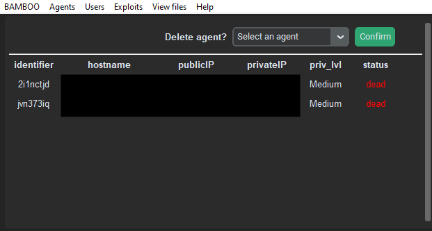
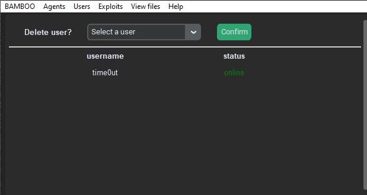
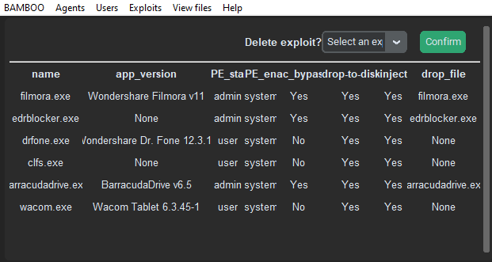
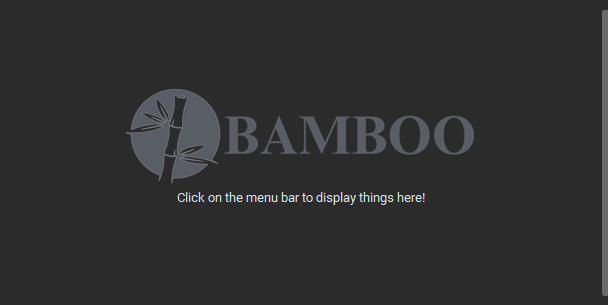
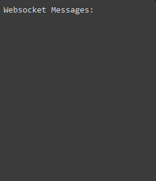
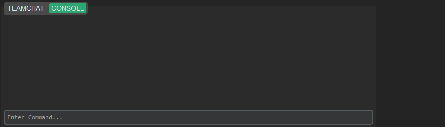
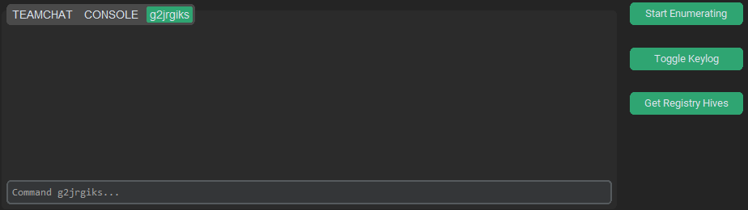

# Widgets

## Description

The main application is where the user will interact with the rest of the framework. In the main application, all widgets have been positioned using the grid() function, and thus can be resized to the user's liking. The font size will also adjust accordingly depending on the height of tabs widget.
The main application consists of 5 main widgets: the menu bar, the display frame, the websocket logs and the tabs.

## Menu Bar

The menu bar is made using the tk.Menu() widget, and contains 6 menu options. Each menu option has its own dropdown, where each dropdown option will either display a table in the display frame, or open a new Toplevel, depending on the function it is bound to.

For the displaying of tables, all follow the same general logic. The items in the display frame will first be cleared with grid.forget(), before retrieving required information from MongoDB and generating the table using CTkLabels and the grid() function. 

### BAMBOO

BAMBOO only has 1 dropdown option: bamboo. 

Clicking on this will clear the items in the display frame, and display the Bamboo logo, which is a CTkImage object, and a label telling users to click on the menu bar to display other items.

### Agents

Agents has only has 1 dropdown option: Display Agents. 

Clicking on this will clear the items in the display frame, and retrieve the agents information from the database using the display_agent() function defined in the agent_commands() class. This will call an API, which will either return a list containing the table headers and agent information, or a string '[x] No agent is connected'.

If the agents table is returned, a table displaying the agents will then be generated, using CTkLabels and information from the table. Above the table and separated by a ttk.Separator widget is where users can kill agents using a dropdown list, which has been dynamically filled with the agent identifiers using the information from the table. Clicking on the Confirm button will call the delete_agent function, which will then kill the selected agent. If successful, the table will refresh.

However, if '[x] No agent is connected' is returned, a label prompting users to run an agent will instead be displayed.

### Users

Users has 2 dropdown options: Display Users and Add User.

Clicking on Display Users will clear the items in the display frame, and retrieve the users information from the database. This is done by calling the /handler/view_users API using the show_users() method defined in the user_commands() class.

A list containing the table headers and a nested list containing the information of each user will then be returned. Using this, a table will then be generated and displayed in the display frame. The user's status will be coloured either green or red if they are online or offline, respectively.

Above the table and separated by a ttk.Separator widget, users can also delete other users using the dropdown list, which has been dynamically generated using the user information retrieved. Clicking on confirm will call the delete_user function, which will get the selected user and call the /handler/delete_user API if the selected user is a valid user. Upon success, the table will refresh.

Clicking on Add User will open up a new Toplevel window, where users can register new users. 

### Exploits

Exploits has 3 dropdown options: Display Exploits, Add Exploit and Modify Exploit.

Clicking on Display Exploits will clear the items in the display frame and retrieve the exploits information from the database. This is done by calling the /exploit/view_all API using the display_exploit() method defined in the exploit_commands() class. 

If there are exploits in the database, it will return a list containing the table headers and a nested list containing the information of each exploit. Using this, a table will then be generated and displayed in the display frame. Users are recommended to increase the window size to see the table clearly.

Above the table and separated by a ttk.Separator widget, users can delete exploits using the dropdown list, which has been dynamically generated using the exploits information retrieved. Clicking on confirm will call the delete_exploit() function, which will get the selected exploit and call the /exploit/delete API if the selected exploit is valid. Upon success, the table will refresh.

If there are no exploits in the database, a 'No exploits in DB' string will be returned. The display frame will then display a label telling users to add exploits into the database.

Clicking on Add Exploit will open up a new Toplevel window, where users can add their own exploits. Files added must be an .exe file, and depending on the options selected, other options will be unhidden. Once there is a valid configuration, users can click on Add Exploit to add their exploit.

Clicking on Modify Exploit will open up a new Toplevel window, where users are able to edit the existing exploits. 

### View files

View files has 3 dropdown options: ... from Enumerate, ... from Keylog and ... from Retrieve.

Clicking on either of the 3 will open up the default file explorer in the /handler/postexp/enumerate, /handler/postexp/keylog or /handler/postexp/retrieve path respectively.

### Help

Help has 2 dropdown options: Help and Technical Doc.

Clicking on Help will open a new Toplevel window containing the commands.

Clicking on Technical Doc will open the document in the browser.

---

## Display Frame

The display frame is made using the CTk.CTkFrame() widget, and is used to display information using 'tables' generated with CTk.CTkLabel() widgets.

Upon launching the main application, the default homescreen for the display frame has the Bamboo logo and text telling the user to click on the main menu to display items there.

Depending on the menu option clicked, the display frame can either display a table of agents, users or exploits. To see the logic for this, refer to the above section.

---

## Websocket Logs

The websocket logs is a CTk.CTkTextbox() widget, and contains messages and/or logs from the Bamboo Teamserver, including messages from the teamchat, as well as any agent connection. Its class is defined in /handler/gui/widgets/ws_textBox.py.

It checks for messages from the Bamboo Teamserver using a websocket process that runs alongside the main process using multiprocessing, and a recursive function that calls itself every 1000ms. This function will check if a message has been received, and will remove the ANSI coding before inserting it into the websocket logs.

---

## Tabs

At the bottom of the widget is a CTk.CTkTabview() widget, which by default contains 2 tabs, TEAMCHAT and MAIN CONSOLE. It can have up to 7 additional tabs for running agents. The class is defined in /handler/gui/widgets/tabs.py.

### Teamchat

The teamchat contains messages from other users. It will periodically check for new messages in the teamchat.txt file using polling. If there are any new messages, it will remove the ANSI encoding and insert the message into the console_output CTk.CTkTextbox() widget. 

Users can also send messages through this tab. Users can type their messages in the CTk.CTkEntry() widget and press enter to send a chat message. 

### Main Console

The main console is mainly where users will run commands. It consists of two widgets, console_output, a CTk.CTkTextbox() widget where the commands entered and the results will appear, and console_input, a CTk.CTkEntry() widget where users can enter commands. The class is defined under /handler/gui/widgets/console.py.

Depending on the commands entered by the user, the application will run different functions and call different APIs, similar to the CLI. The available commands can be found below. 

#### help

Usage: `help`

Shows all possible commands in console_output.

#### exit / quit

Usage: `exit` or `quit`

Quits the client, and terminates the websocket connection. The user will then be set as offline.

#### clear

Usage: `clear`

Clears the chat log and teamchat. This will clear the teamchat.txt file.

#### users

Usage: `users`

Displays the table of users. The information is retrieved from the database using the show_users() method defined in the user_commands class, and then displayed in console_output using tabulate.

#### register

Usage: `register`

Opens a CTk.CTkToplevel window where users can register new users. This Toplevel window is defined in /handler/gui/func/run_register.py.

The text in console_output will reflect whether the user closed the window, or successfully registered another user. 

#### remove

Usage: `remove [user]`

Removes the user given. The application will call the corresponding API and attempt to delete the user. The result in console_output will reflect whether or not it is successful.

If the user did not put a username, an error message informing the user of the correct usage will be printed.

#### display

Usage: `display`

Displays all connected agents. The application will call the corresponding API and retrieve the agent information, and return it as `status`. If `status` contains the table, it will be displayed in console_output using tabulate; otherwise, '[x] No agent is connected' will be printed.

#### use

Usage: `use [agent_identifier]`

Opens a new tab for the given agent identifier. Up to 7 tabs can be opened using this command. If there are already 7 agent identifier tabs open, or if the agent is already in use or does not exist, or an agent identifier was not given, the corresponding error message will be printed in console_output.

More information about the commands that can be used in the agent identifier tabs can be found in the next section.

#### kill

Usage: `kill [agent_identifier]`

Kills the agent given. The application will call the corresponding API and attempt to kill the given agent. The result will then be printed in console_output. If no agent identifier was given, an error message will be printed.

#### exp

Usage: `exp`

Displays all exploits. The corresponding API will be called and the exploits information will be retrieved, and returned as `exploit_table`. If `exploit_table` is not 'No exploits in DB', the information will be displayed in console_output using tabulate.

#### add

Usage: `add`

Opens a new CTk.CTkToplevel window where users can add their own exploits. This toplevel window is defined in /handler/gui/func/run_add.py.

The exploit's file must be an .exe. Other options for the exploit can be chosen, and will differ based on the selections chosen.

#### delete

Usage: `delete [exploit_name]`

Deletes the given exploit. The application will call the corresponding API and attempt to delete the given exploit. The result will then be printed in console_output. If no exploit name was given, an error message will be printed.

#### modify

Usage: `modify`

Opens a new CTk.CTkToplevel window where users can modify existing exploits. This toplevel window is defined in /handler/gui/func/run_modify.py.

Modifying exploits must follow the same rules as adding an exploit, such as files must be .exe, etc.

### Agent Identifier Tabs

Agent identifier tabs can be opened using the `use [agent_identifier]` command in MAIN CONSOLE. Only 7 agent identifier tabs can be opened at any one time on a client.

Clicking on an agent identifier tab will show three buttons: Start Enumerating, Toggle Keylog and Get Registry Hives. These buttons are only shown when the current tab is an agent identifier tab, and will not appear in TEAMCHAT or MAIN CONSOLE. As there is no tab-changed event for CTk, this is done using a recursive function that checks for the current tab every 100ms and hides or shows the buttons accordingly.

The three buttons, as well as the commands that can only be used when an agent is in use, can be found below. 

#### stop

Usage: `stop`

Stops using the agent. This will close the tab, but will not kill the agent.

#### info

Usage: `info`

Shows the information of the current agent. The corresponding API is called, and the information of the current agent is retrieved from the database. The information will then be displayed in console_output using tabulate.

#### exploit

Usage: `exploit`

Opens a new CTk.CTkToplevel window where users can select the exploit to run. This toplevel window is defined in /handler/gui/func/run_exploit.py.

#### cmd

Usage: `cmd`

Opens a command prompt for the current agent.

#### enum / Start Enumerating

Usage: `enum` or click on Start Enumerating

Enumerates on the victim machine. Files can be found under /handler/postexp/enumerate.

#### postexp / Toggle Keylog & Get Registry Hives

Usage: `postexp [keylog|retrieve]` or click on Toggle Keylog/Get Registry Hives

Runs a post-exploitation method based on the method given. Entering `keylog` as the method or clicking on Toggle Keylog will start/stop logging keystrokes, while entering `retrieve` as the method or clicking Get Registry Hives will retrieve the registry hives.

Files can be found under /handler/postexp/keylog and /handler/postexp/retrieve.