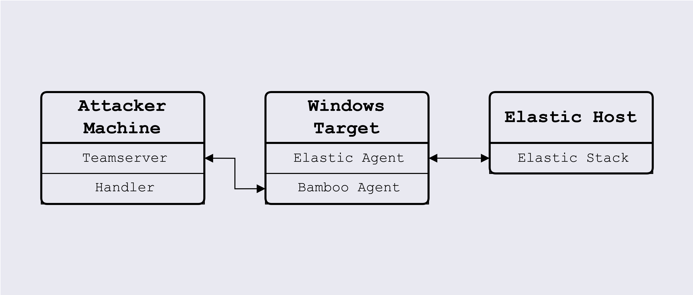

# Prerequisites

## Systems Required

As Bamboo is a penetration testing C2 Framework, it will require multiple systems to be set up and connected.

At minimum, two machines are required – one 'attacker' machine where the Bamboo Teamserver and Client is set up and where the attacker will be working from, and one 'target' machine that has the Bamboo Agent and is the target for the attacker.

An Elastic Stack deployment can also be set up to monitor the target machine, to test the evasion capabilities of Bamboo. To set up Elastic, refer to this documentation for a self-managed deployment.

The attacker machine should be a Linux machine, preferably Kali Linux. It should also have the following running on it:

- Python 3.11 or above with Pip as its package installer

The target machine is a Windows 11 machine with the Bamboo Agent located in the Desktop folder. To fully use the exploits in Bamboo, download the following applications:

| **Application**                             | **Download link**                                                                                                                                                                    | **Description**                 |
| ------------------------------------------- | ------------------------------------------------------------------------------------------------------------------------------------------------------------------------------------ | ------------------------------- |
| Microsoft Visual C++ redistributables (x86) | [https://aka.ms/vs/17/release/vc_redist.x86.exe](https://aka.ms/vs/17/release/vc_redist.x86.exe)                                                                                     | For NtQueue injection           |
| Wondershare Filmora                         | [https://drive.google.com/file/d/1_Y2tvYV5k76dFDIKTdaH1ULfNQB-ccHT/view](https://drive.google.com/file/d/1_Y2tvYV5k76dFDIKTdaH1ULfNQB-ccHT/view)                                     | For Wondershare Filmora exploit |
| Wacom Driver                                | [https://cdn.wacom.com/u/productsupport/drivers/win/professional/WacomTablet_6.3.45-1.exe](https://cdn.wacom.com/u/productsupport/drivers/win/professional/WacomTablet_6.3.45-1.exe) | For Wacom Driver exploit        |
| BarracudaDrive                              | [https://download.cnet.com/barracudadrive/3001-18506_4-10723210.html](https://download.cnet.com/barracudadrive/3001-18506_4-10723210.html)                                           | For BarracudaDrive exploit      |

There should also be a Windows machine, which is the target or otherwise, that can be used to build the Go agent (and transfer to the target machine).
