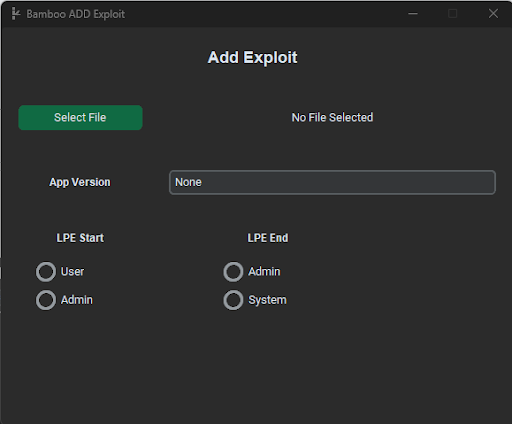

# Command Guide

This page covers how to perform general actions using the GUI Client. 

## Agent Control

Commands in here assume you are in an agent console. To do that, enter `use [agent id]` in the main console and go to the new tab created. 

### Run Exploit

Enter `exploit` in the agent console. 

- A popup will appear to select configurations. The options you have depend on the exploits available and the settings on them.
- First you choose an exploit from the Teamserver’s database
- The next choice is the evasion technique, if injection is an option for the exploit. The choices are:
    1. Drop-to-Disk – drop exploit to disk and run it (i.e. no evasion technique applied)
    2. Process Injection
    3. Virtual Allocation
    4. Gadget Injection
- Choose the Donut shellcode options. Default is recommended

After configuration, press "EXPLOIT" to send the command. The console should print a message saying the exploit command is confirmed. 

To confirm that the exploit works, observe the target machine. Exploits included with the Teamserver should spawn an elevated Agent to connect back to the Teamserver, so also pay attention to the Websocket messages. 

### Additional Actions

You can use the three commands (enum, postexp keylog, postexp retrieve) or use the buttons at the side to run them. Take note retrieving registry hives require the agent to be at least High or System privilege. 

The results are saved in `/handler/postexp/` as printed on the console when it is completed. To access it quickly, use the Menu > View files 

### Kill Agent

To end an agent, enter `kill [agent id]` in a console. It will tell the agent to terminate itself and the Teamserver will remove it from its database

### Stop Controlling Agent 

To close the console of an agent, enter `stop` in the console of the agent. This does not disconnect or terminate the agent

### Terminal Commands 

To access a terminal/command prompt in the agent, enter `cmd` in the agent’s console. 

From here, you can enter commands and it will execute in a command prompt. 

To stop using the command prompt, enter `exit` in the console.

## Exploit Management

### Display Exploits

Go to Menu > Exploits > Display Exploits 

The available exploits in the database will be in the Display panel 

### Add Exploit

To add exploits, either enter `add` in a console or go to Menu > Exploits > Add Exploits to launch a new window to add exploits. 

When adding exploits, the user will configure the following:

1. Select the exploit to use (as an exe file)
2. App version target
3. Privilege level required to exploit (LPE start), and resulting privilege (LPE end)
    - If LPE start is Admin, the Teamserver will automatically set that UAC Bypass is required
4. Select whether Drop-to-Disk and/or Injection is suitable for the exploit.

### Modify Exploit

To modify exploits, either enter `modify` in a console or go to Menu > Exploits > Modify Exploits to launch a new window to add exploits. 

Use the dropdown to select the exploit to modify. The options you can modify are:

- Exploit Name - what the exploit will be saved and appear as
- App Version
- LPE Start
- LPE End
- Evasion Method

### Delete Exploit

Deleting an exploit can be done with either the Console or the Display panel. 

Console method: 

- Enter `delete [exploit name]` into a console

Display panel method:

1. Open the table of exploits on the Display panel with Menu > Exploits > Display Exploits 
2. At the “Delete exploit?” dropdown, select the exploit to remove and click Confirm. 

## User Management

### Display Users
Go to Menu > Users > Display Users

### Add User
To modify exploits, either enter `register` in a console or go to Menu > Users > Add User to launch a new window to add exploits. 

Enter a username and password for the new user and click Register. You may not create a username that already exists.

### Remove User
To remove a user account, you can do the following:  

1. Open the table of exploits on the Display panel with Menu > User > Display User 
2. At the “Delete user?” dropdown, select the user to remove and click Confirm  

## Other Functions

### Team Chat
To access the Team Chat, go to the TEAMCHAT tab. You can send messages by entering your message in the text box.

To remove the message history, enter the `clear` command in another console.

