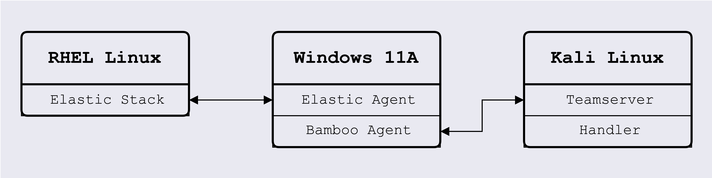

# Recommended Setup

As Bamboo is a penetration testing C2 Framework, it will require multiple systems to be set up and connected. In order to fully experience the functions of Bamboo, the following setup is recommended.

## Systems Required

1. Attacker Machine: Linux (Kali is recommended)
   - Install the [Bamboo Teamserver](installation/teamserver-setup.md)
   - Run the [Bamboo Client](using_bamboo_client.md)
2. Elastic Stack Host:
   - The Elastic Stack can be deployed by following this [guide](https://www.elastic.co/guide/en/elastic-stack/current/installing-stack-demo-self.html) by Elastic.
   - Install the [Elastic Defend](https://www.elastic.co/guide/en/security/current/install-endpoint.html) and [Windows](https://www.elastic.co/docs/current/integrations/windows) integrations.
3. Target: Windows 11 machine
   - [Microsoft Visual C++ Redistributables](https://aka.ms/vs/17/release/vc_redist.x86.exe) must be installed
   - After [building the Bamboo Agent](installation/agent-setup.md), the agent file must be placed in the Desktop folder of the target
   - Ensure that the Elastic Agent is also installed to monitor the target
   - You can choose to [download the vulnerable applications](#vulnerable-application-installers) for Bamboo's pre-loaded exploits

For testing purposes, these can be hosted as Virtual Machines using a software to run VMs such as [VMWare Workstation](https://blogs.vmware.com/workstation/2024/05/vmware-workstation-pro-now-available-free-for-personal-use.html) or [VirtualBox](https://www.virtualbox.org/wiki/Downloads).

The image below illustrates how the setup should look like.

## Vulnerable Application Installers

The target machine will be a Windows 11 machine and the Bamboo Agent should be located in the Desktop folder. If you wish to use the pre-loaded exploits in Bamboo, download the following applications on the target:

| **Application**                             | **Description**                                | **Download Link**                                                                                                                                                                    |
| ------------------------------------------- | ---------------------------------------------- | ------------------------------------------------------------------------------------------------------------------------------------------------------------------------------------ |
| Microsoft Visual C++ redistributables (x86) | For NtQueue injection                          | [https://aka.ms/vs/17/release/vc_redist.x86.exe](https://aka.ms/vs/17/release/vc_redist.x86.exe)                                                                                     |
| Wondershare Filmora                         | For Wondershare Filmora vulnerable application | [https://drive.google.com/file/d/1_Y2tvYV5k76dFDIKTdaH1ULfNQB-ccHT/view](https://drive.google.com/file/d/1_Y2tvYV5k76dFDIKTdaH1ULfNQB-ccHT/view)                                     |
| Wacom Driver                                | For Wacom Driver vulnerable application        | [https://cdn.wacom.com/u/productsupport/drivers/win/professional/WacomTablet_6.3.45-1.exe](https://cdn.wacom.com/u/productsupport/drivers/win/professional/WacomTablet_6.3.45-1.exe) |
| BarracudaDrive                              | For BarracudaDrive vulnerable application      | [ https://download.cnet.com/barracudadrive/3001-18506_4-10723210.html](https://download.cnet.com/barracudadrive/3001-18506_4-10723210.html)                                       |
| Wondershare Dr Fone                         | For DrFone vulnerable application              | [https://filehippo.com/download_wondershare-drfone-android/history/](https://filehippo.com/download_wondershare-drfone-android/history/)                                             |
