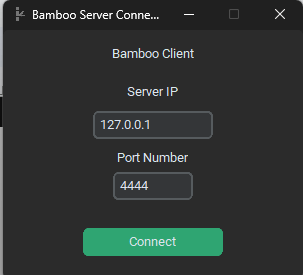
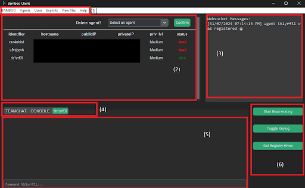
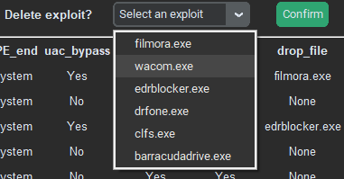

# Using Bamboo Client 

This page covers usage of the Bamboo Client GUI. The CLI alternative also uses the same commands.

## Running GUI

You can run the Bamboo Client on the same machine as the Teamserver with the command:

```
python handler_gui.py
```
When starting the client, the first window to appear is the connection window. 



Enter in the IP address and port the Teamserver is running on and press "Connect". If successful, you will be brought to the login window.


Enter your username and password and press "Login" to authenticate with the Teamserver. When successful, you will be brought to the main menu. 

The Teamserver IP, port number, and login username fields will be saved across sessions. 

## Main Menu



(1) Menu Bar – Provides easy access to display and manage resources on the server. The tabs in the Menu Bar are as follows:

- BAMBOO – Display the Bamboo icon on the Display panel
- Agents — Allow the user to see the Bamboo Agents connected to the Teamserver in the Display Table. 
- Users – Display users stored in the Teamserver’s database or bring up a window to add a new user account.
- Exploits – Display exploits stored in the Teamserver’s or bring up a window to add an exploit. 
- View files – Opens the File Manager application for the folders that stores the results of post-exploitation functions or system enumeration
- Help - Displays Technical Documentation and Help menu for commands

(2) Display panel – Displays information selected from the Menu Bar in a table format. The table comes with a dropdown to remove specific items from the database or disconnect agents 



(3) Websocket Messages – Shows team chat messages and agent connection updates from the Websocket connection with the Teamserver. 

(4) Tabs – Allows you to see which console you are on and switch between consoles. The default tabs that are available at all times are:

- TEAMCHAT – Allows the user to send and read messages via the Teamchat function
- CONSOLE – The main console to run general commands. 

A new agent tab (labelled by the agent id) can be created with the command `use [agent id]` in the console. This tab will allow users to use agent-specific commands to control and command the agent. 

(5) Console – Displays the command-line console for the selected tabs. For more information about the commands, refer to [commands](../Client/commands.md)` 

(6) Buttons – Buttons to command selected agent to perform selected functions. The available actions using these buttons are:

- Start Enumerating – perform system enumeration on the host the Agent is on
- Toggle Keylog – Start or stop the keylogging function on the Agent
- Get Registry Hives – Get important files (sam, system, security) from the host the Agent is on. Only available for Agents at High or System privilege
