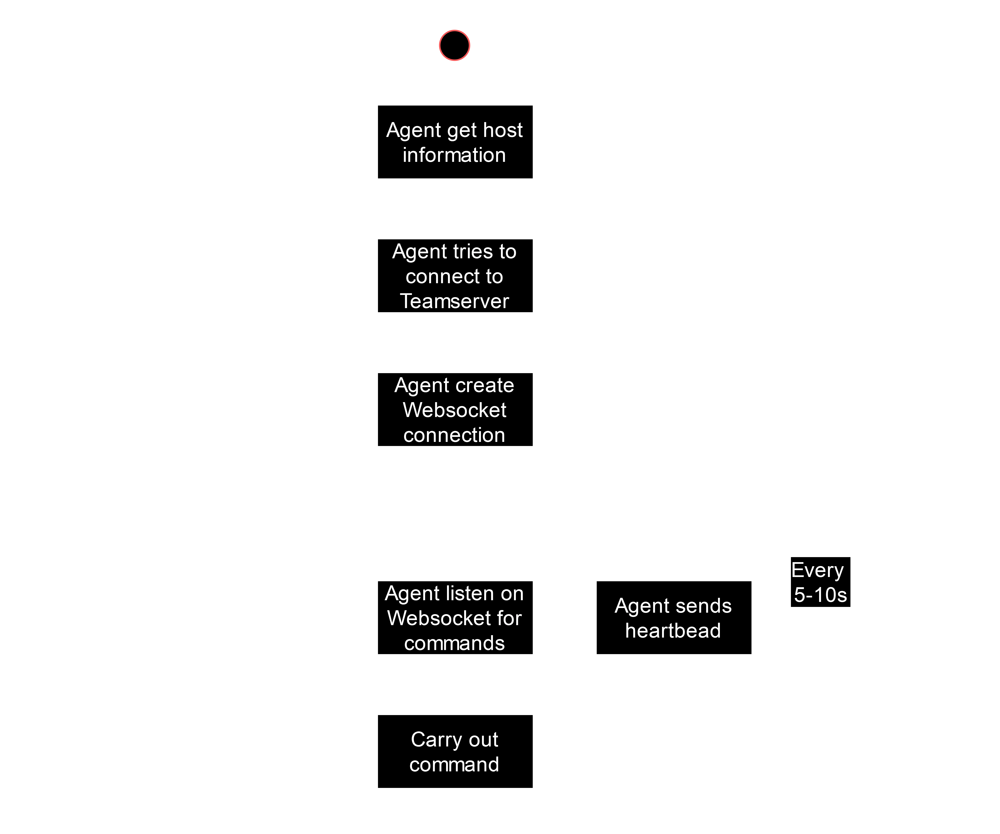

# Bamboo Architecture

This section will provide an overview of the Bamboo Framework components and how they interact. The Bamboo Framework consists of 3 major entities: The Client, the Teamserver and the Agent. The architecture diagram below illustrates how the components in each of these entities interact with one another.

## Bamboo Client

The Bamboo Client acts as the handler for the Bamboo Teamserver. Developed with [Python 3.11](https://www.python.org/downloads/release/python-3110/), the user can use either the command line (CLI) or graphical interface (GUI) to interact with the rest of the framework and perform actions such as:

- Run exploits on a target through the agent
- Add and modify exploits available on the Teamserver
- Use the team chat to message other Bamboo users on the same server

The Bamboo Client can be run on most computers, but it is recommended to run it on the same host as the Teamserver, if only one Client is in use.

### Components

| Component                 | Description                                                     | Usage                                                                                          |
| ------------------------- | --------------------------------------------------------------- | ---------------------------------------------------------------------------------------------- |
| Commands                  | Contain classes that directly calls the Bamboo Teamserver endpoints | Bamboo Client command will call the functions within the classes                               |
| GUI Component             | Contain all GUI only related folders and files                  | Bamboo Client GUI was built with and rely on this component to interect with the Bamboo Teamserver |
| Functions                 | Contain miscellaneous functions that is called everywhere       | Bamboo Client relies on these function to be functional                                         |
| WebSocket Client          | Connects to server WebSocket                                    | Makes connection to the Bamboo Teamserver WebSocket and process broadcasted messages               |
| Post Exploitation Methods | Contain preloaded post exploit tools                            | Bamboo Clients can use these tools to furture extract valuable information                     |
| Post Exploits             | Results of post exploit tools are stored here                   | Bamboo Clients can view the results of the post exploitation tool                              |

## Bamboo Teamserver

The Bamboo Teamserver, designed to run on a Kali Linux machine, is the central server that records and stores data and exploits, and acts as the communication bridge between the users and the Agents. It hosts both [HTTPS RESTful APIs](./Teamserver/api_reference/overview.md) and manages Websocket connections to handle communications with other components in the framework.

The Teamserver is built in [Python 3.11](https://www.python.org/downloads/release/python-3110/), and uses [Flask](https://flask.palletsprojects.com/en/3.0.x/) for HTTPS communication. [MongoDB](https://www.mongodb.com/try/download/community) is used to store information such as user accounts, agents connected and their status, as well as exploits and their configurations.

The Teamserver keeps track of Agents connected to it by storing their information in the database, and constantly receives heartbeat messages from them to ensure they are alive. The Teamserver then updates the status of the Agents, and mark agents that has not communicated the heartbeat back as 'dead', which gets cleaned from the database after a while.

By default, the port used by the Teamserver is TCP 4444

### Components

| Component          | Description                                                                       | Usage                                                                       |
| ------------------ | --------------------------------------------------------------------------------- | --------------------------------------------------------------------------- |
| APIs               | All endpoints that enable Bamboo to communicate                                   | Bamboo Client and Bamboo Agent pass information using the endpoints         |
| WebSocket API      | Enable Bamboo Client and Bamboo Agent to connect via WebSocket                    | Allows WebSocket connection                                                 |
| Database (MongoDB) | Contains everything related to database (models, initialisation, and collections) | Allows the Bamboo Teamserver to initialise and interact with the database easily |
| Functions          | Contain miscellaneous functions that is called everywhere                         | The Bamboo Teamserver relies on these function to be functional                  |
| PEM Files          | Contains the certificate and key                                                  | Allows the Bamboo Teamserver to run in HTTPS and WSS with SSL                   |

## Bamboo Agent

The Agent an executable program developed using the [Go programming language](https://go.dev/), and designed to run on a Windows 11 host. It resides in the target machine, and it is recommended for the Agent should be located in a user's desktop directory for the exploits made for the Bamboo Framework to work with the best effect.

When the Agent is ran by either the command line or double clicking, it first collects information about the host and itself, such as preferred local and public IP addresses, hostname, and integrity level the agent is running at. The Bamboo agent then will repeatedly attempt to connect to the Bamboo Teamserver. Once it is connected, it will initialise a WebSocket connection with the Teamserver to allow it to receive instructions from the server.

Once the agent is connected, it will perform two main actions:

1. Listen to the Websocket connection for commmands send from the server
2. Repeatedly send heartbeat messages to the Teamserver to indicate it is 'alive'
   - To do this concurrently, the heartbeat function is ran in a goroutine for concurrency

### Components

| Component              | Description                         | Usage                                                                                |
| ---------------------- | ----------------------------------- | ------------------------------------------------------------------------------------ |
| WebSocket Client       | Connects to Teamserver WebSocket    | Makes connection to the Bamboo Teamserver WebSocket and process commands sent through it |
| HTTPS                  | HTTP RESTful communication          | Makes connection to the Bamboo Teamserver APIs to send information or request for data   |
| Functions              | Miscellaneous functions             | Other commands the agent can perform                                                 |
| Post Exploit Functions | Contain post exploit functions      | Agent runs post-exploitation or enumeration function on command                      |
| Exploit Methods        | Contain methods to execute exploits | Agent receives and executes exploits on command                                      |
