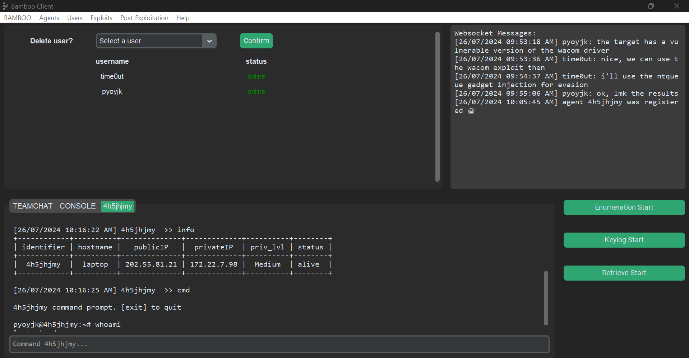

# Introduction

Bamboo is a Command & Control (C2) Framework that consists of three main components: Bamboo Client, Bamboo Teamserver, and Bamboo Agent. These components work together to allow users to have a seamless scalable experience to do penetration testing or general testing of evading Elastic. 
Bamboo offers multiple pre-built evasion techniques that are well tested and modified to evade Elastic. Moreover, there are multiple built-in third party exploits that users can use initially to try out Bamboo.

This website documents the various components of the Bamboo Framework, including its evasion tools, pre-built exploits, post-exploitation tools and how to use the framework.